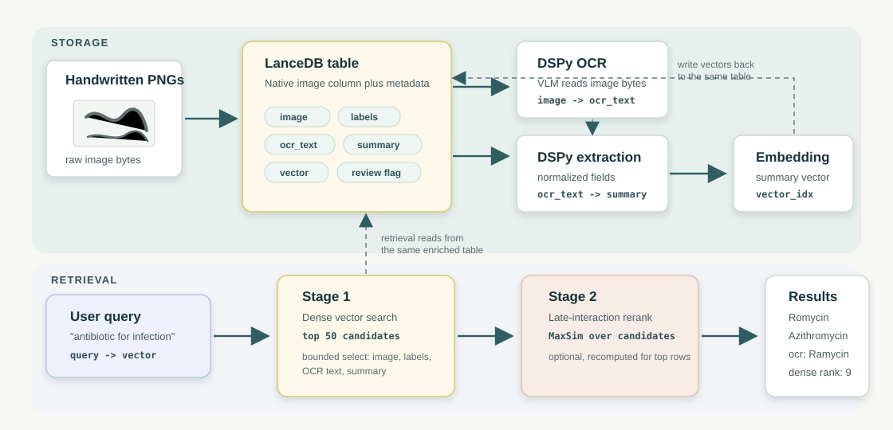

# Handwritten Documents OCR Retrieval in LanceDB

This repository demonstrates how to use [LanceDB](https://docs.lancedb.com/) as the storage and
retrieval layer using handwritten documents and OCR-extracted text for document search.
It uses [this Kaggle Doctor Handwriting Recognition Dataset](https://www.kaggle.com/datasets/mamun1113/doctors-handwritten-prescription-bd-dataset)
The dataset is stored under the `data/` directory in this repo (download the dataset from Kaggle and place it in this location)

The main idea is that the handwritten PNG images of doctor's notes are stored natively as raw image bytes in LanceDB.
OCR, structured extraction features, embeddings, search results, and validation labels all live in the same table.
During OCR, the model receives the image bytes read back from LanceDB, and it writes back its predicted text into the same LanceDB table.

The table below shows how we clearly separate the storage stage from the retrieval stage, both of which involve LanceDB.



### Why OCR in the first place?

Answering questions by retrieving the image is not desirable for two reasons: a) Vision-based reasoning over pixels is more expensive than reasoning over text, and b) the pixels themselves are fuzzy, unclear and potentially lossy. By extracting the text from the image via OCR, we can use a cheap text-based embedding model
like `sentence-transformers/all-MiniLM-L6-v2`, and our query can run on that instead.

This is the primary job of OCR: `image bytes → ocr_text → searchable_summary → vector`. It
enables vector search over plain text (where only images existed before), and the same text also powers the full-text index, the late-interaction reranker, the structured `medicine_name`/`generic_name` fields, and the evaluation against ground-truth labels. This can massively reduce token usage in production for large
datasets.

## Setup

All scripts have been tested with `uv`, so this is the recommended way to set up the Python environment:

```bash
uv sync
cp .env.example .env
# add GEMINI_API_KEY=... to .env
```

If you prefer, you can also run the code with standard `venv` and `pip`:

```bash
python -m venv .venv
source .venv/bin/activate
pip install -r requirements.txt
cp .env.example .env
# add GEMINI_API_KEY=... to .env
```

If you're not using `uv`, use standard `python *.py` commands to run the scripts below.

## Pipeline

The stages are run in the following order, via the `uv` commands listed below:

```bash
uv run src/00_inspect_data.py
uv run src/01_ingest_images.py
uv run src/02_ocr.py
uv run src/03_extract.py
uv run src/04_embed_index.py
uv run src/05_search.py "antibiotic medication" "fever and pain medication"
uv run src/06_rerank.py "antibiotic for infection"
uv run src/07_evaluate.py --run-name "Unoptimized baseline" --output outputs/baseline_results.md
uv run src/08_optimize_ocr.py --auto medium
```

We ingest the full Testing split from the source data: 780 data rows. The CSV has 781 lines including
the header. Use `--limit 10` on any stage for quick local debugging.

> [!NOTE]
> `src/01_ingest_images.py` compacts the table after the initial local LanceDB ingestion, by calling `table.optimize()`. The OCR script in `src/02_ocr.py` runs async DSPy model calls and then bulk-writes results back to LanceDB in batches.

## Enterprise Geneva OCR Backfill

For Enterprise runs, use a fresh physical table name for each destructive experiment instead of
dropping and immediately recreating the canonical table name. This avoids races with asynchronous
table cleanup on the old storage prefix.

```bash
RUN_TABLE=doctor_handwriting_gv_20260707_001
uv run src/01_ingest_images.py --remote --mode create --table-name "$RUN_TABLE"
uv run src/02_ocr_geneva.py --table-name "$RUN_TABLE" --column ocr_text --concurrency 8
```

After the backfill, point downstream scripts or demos at the verified run table. Keep old run tables
around during active iteration; clean them up later only after they are no longer needed.

### LanceDB-specific code

The LanceDB-specific pieces of the codebase are intentionally separated into logical components and concentrated in a few files:

| File | Role |
| --- | --- |
| `src/db.py` | Defines the `DoctorHandwriting` schema (raw `image: bytes`, validation labels, OCR/extraction fields, 384-dim `vector`) and centralizes the DB connection, table creation/opening, bounded reads, and merge updates. |
| `src/01_ingest_images.py` | First write path: reads Testing-split PNGs as bytes, stores them directly in the table, adds validation-only labels, and runs `table.optimize()` once after ingestion. |
| `src/02_ocr.py`, `src/03_extract.py` | Downstream stages that read bounded rows from the same table and write computed columns back with batched `merge_insert` updates. |
| `src/04_embed_index.py` | Embeds `searchable_summary`, writes the `vector` column, and builds the scalar, full-text, and vector indexes. |
| `src/05_search.py` | Baseline dense retrieval using `table.search(query_vector)` with explicit `select(...)` and `limit(...)`. |
| `src/06_rerank.py` | Starts from LanceDB dense candidates, then applies optional late-interaction reranking outside the table. |
| `src/07_evaluate.py` | Reads bounded Testing rows and publishes baseline OCR/extraction metrics against the validation labels. |
| `src/08_optimize_ocr.py` | Optional final stage: inserts missing Training/Validation rows into the local LanceDB table, runs DSPy GEPA over the OCR signature, and saves an optimized program state. |

## Interfacing with VLMs

OCR and structured extraction are implemented with DSPy:

- OCR uses `dspy.Image` and `dspy.LM("gemini/gemini-3.1-flash-lite")`.
- Extraction uses a DSPy signature over `ocr_text` with `gemini/gemini-2.5-flash-lite`.
- GEPA reflection defaults to `gemini/gemini-3.1-pro-preview`.
- `GEMINI_API_KEY` is read from `.env` or the environment.

The OCR stage is expected to make live model calls. A `--mock-from-labels` flag exists only for quick
developer smoke tests of the storage/indexing path; do not use it for reported OCR quality.

### Why DSPy?

There are many reasonable ways to do structured extraction from OCR text, including native
structured-output endpoints from LLM/VLM providers. This demo uses DSPy because the OCR and extraction
steps become composable programs rather than one-off prompts. This matters because the prompts, field
descriptions, and overall program can be optimized with algorithms like
[GEPA](https://arxiv.org/abs/2507.19457), instead of relying only on manual prompt engineering.

This is also why the provided dataset's source splits are useful. The "Testing" split stays reserved for the
demo evaluation path, while the "Training" split can become a labeled optimization dataset that we can
use at a later stage. First, we run the unoptimized OCR/extraction pipeline and publish its Testing-split
baseline with the following command:

```bash
uv run src/07_evaluate.py
```

That produces `outputs/baseline_results.md`, including a table the one shown below.

Use the following metric key to understand the results in the table:

- `Exact OCR match`: the model output exactly matches `MEDICINE_NAME`, including casing and punctuation.
- `Normalized OCR match`: both strings match after lowercasing and removing non-alphanumeric
  characters. This is the more forgiving word-level accuracy number.
- `Avg edit distance`: average Levenshtein distance after normalization. It is the number of
  single-character insertions, deletions, or substitutions needed to turn OCR text into the ground truth label.
- `Median edit distance`: the middle edit distance. A median of `1.00` means at least half the
  samples are within one character edit, even though many still fail exact/normalized matching.
- `Human review flagged`: rows where the OCR output differed enough from the label to merit review.
- `Extraction coverage`: rows where the structured extraction stage populated all expected fields.

| Run | OCR model | Split | Rows | Exact OCR match | Normalized OCR match | Avg edit distance | Median edit distance | Human review flagged | Extraction coverage |
| --- | --- | --- | ---: | ---: | ---: | ---: | ---: | ---: | ---: |
| Unoptimized baseline | `gpt-5.4-mini` | Testing | 780 | 27.8% | 35.1% | 1.60 | 1.00 | 43.5% | 100.0% |

This table is a historical baseline from the earlier GPT-backed configuration. After switching models,
rerun `src/07_evaluate.py` to write fresh Gemini baseline metrics before running optimization.

These results (and the edit distances) show that most extractions are off by just ~1-2 characters, so the low accuracy
numbers can be improved with a better model, or a better description of the extraction task.

Prompt optimization can help with this: a GEPA optimization pass over Training examples and compare
the optimized program against the same held-out Testing rows. With frameworks like DSPy, the OCR/extraction program
can be optimized to squeeze more quality out of a smaller, cheaper model. For document pipelines, that
can make the difference between a neat prototype and a system that scales to more images without
spending heavily on LLM tokens.

### Optional: Optimize the OCR Signature

`src/08_optimize_ocr.py` is the final optional pipeline stage. It uses the local LanceDB table, inserts
missing `Training` and `Validation` split rows into that table, then runs DSPy's GEPA optimizer against
the OCR DSPy signature. `Training` is passed as the GEPA trainset, and `Validation` is passed as the
GEPA valset. The student model defaults to `gemini/gemini-3.1-flash-lite`; the reflection model defaults
to `gemini/gemini-3.1-pro-preview`.

The default command uses the full Training split and a seeded, shuffled 192-row Validation sample.
Keeping the GEPA valset smaller gives the optimizer more room to explore prompt variants within the
same metric-call budget. Use `--val-limit 0` only when you explicitly want all Validation rows in the
GEPA valset.

The default GEPA metric is a simple combined objective: `90%` normalized exact OCR accuracy and `10%`
edit-distance similarity. This makes normalized match dominate while still giving GEPA a directional
signal among near misses. If you want a purely binary normalized-match objective, pass
`--metric-style normalized_exact`.

```bash
uv run src/08_optimize_ocr.py --auto medium
```

Useful variants:

```bash
# Use smaller slices of Training/Validation for a smoke run.
uv run src/08_optimize_ocr.py --auto light --train-limit 512 --val-limit 128

# Use all Training and Validation rows, at the cost of less exploration per budget.
uv run src/08_optimize_ocr.py --auto medium --val-limit 0
```

The optimized DSPy program is saved to `outputs/optimized_ocr_reader.json`, with reports under
`outputs/optimization/`. To apply that optimized signature in a later OCR pass:

```bash
uv run src/02_ocr.py --program-path outputs/optimized_ocr_reader.json --overwrite
uv run src/07_evaluate.py --run-name "Optimized OCR" --output outputs/optimized_results.md
```

## Retrieval

`src/04_embed_index.py` embeds `searchable_summary` with
`sentence-transformers/all-MiniLM-L6-v2`, writes the 384-dimensional vector column, and builds:

- scalar indexes on `id`, `category`, and `needs_human_review`
- a full-text index on `searchable_summary`
- a cosine vector index on `vector`

### Optional: Late-interaction Reranking

`src/06_rerank.py` uses a ColBERT-style late-interaction pass by default with
`colbert-ir/colbertv2.0`: it encodes query and candidate text into token vectors, then scores each
candidate with MaxSim over the dense-search candidate set. Search and reranking scripts export
decoded image previews under `outputs/`.

### Example Retrieval Results

```bash
uv run src/05_search.py "antibiotic medication" --limit 3
```

```text
Query: antibiotic medication
Image previews: outputs/search/antibiotic-medication
01. distance=0.3693 id=test_00614 label=Omastin generic=Fluconazole ocr='Amoxicin' normalized='Amoxicin' category=medication review=True
02. distance=0.3708 id=test_00222 label=Diflu generic=Fluconazole ocr='Diffl' normalized='Diffl' category=medication review=True
03. distance=0.3780 id=test_00178 label=Candinil generic=Fluconazole ocr='Cemdinol' normalized='Cemdinol' category=medication review=True
```

Dense search finds medication-relevant rows, but the noisy OCR text pushes all three into human review.

```bash
uv run src/06_rerank.py "antibiotic for infection" --candidate-limit 10 --limit 3
```

```text
Query: antibiotic for infection
Dense top results:
  01. distance=0.4501 test_00614 Omastin (Fluconazole)
  02. distance=0.4543 test_00177 Candinil (Fluconazole)
  03. distance=0.4632 test_00175 Candinil (Fluconazole)
Late-interaction reranked results:
  01. late=2.2198 dense_rank=9 id=test_00699 label=Romycin generic=Azithromycin Dihydrate (Ophthalmic) ocr='Ramycin'
  02. late=2.2084 dense_rank=4 id=test_00698 label=Romycin generic=Azithromycin Dihydrate (Ophthalmic) ocr='Rnycin'
  03. late=2.1979 dense_rank=8 id=test_00694 label=Romycin generic=Azithromycin Dihydrate (Ophthalmic) ocr='RMYCIN'
```

Late interaction reranking promotes candidates with stronger token-level evidence for the query.

## Use LanceDB Enterprise for Production

Note that LanceDB OSS is fine for this local, reproducible proof-of-concept.

For real-world datasets, [LanceDB Enterprise](https://docs.lancedb.com/enterprise) is recommended as the natural
production path for larger document-intelligence workloads because it comes with the following benefits:
- More scalable retrieval due to separation of compute from storage
- Unbounded storage (larger, higher resolution images) leading to petabyte scale and beyond
- Scalable feature engineering with [Geneva](https://docs.lancedb.com/geneva)
- Access control, governance, operational monitoring, and reliability controls

Workflows like these in healthcare or other highly regulated spaces should **always** include
human validation (ideally with prompt optimization for better performance on the task),
auditability, approved datasets and models, security review, and appropriate compliance checks.
